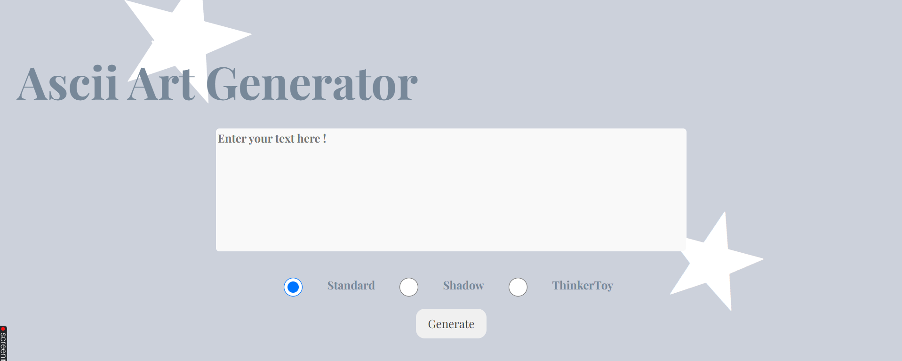

### Description

This project is a ascii art genrator webpage that can be hosted in you machine. In addition, it can be used in any device that have golang in it (not sure about mobile devices). Also, it's not resource hungry (you can run it with your potato pc/laptop).

\*\* NOTE: This project build with love do not try to break it. auditors you can pass some issues IF THERE IS ANY!

### Authors

1- Duaa AlMahal (dalmahal)

2- Mariam Adel (maadel) https://github.com/MariamAdel9

3- Qassim Zuhair (qzuhair)

### Usage: how to run

To run this program you first need to have golang installed in your machine.

- Clone the repo and run the program on your local host (http://localhost:8080/)

- You will see this page:

- As you can see there is a text box, you can type whatever you want (unlike chatgpt), choose what type of banner you want (standard is chosen by default), you can choose only one type of banner at a time. (if you want to choose more than one in each time you have to pay lol).

- Lastly you can hit genrate.

- DONE your output will be shown in seconds.

### Implementation details: algorithm

#### Server Setup:

Uses the net/http package to listen for HTTP requests and route them to the Post function.

#### Handling Requests:

**GET Requests:** Checks if the URL path is /asciiart. If valid, it renders the index.html template for user input; otherwise, it returns a 404 error.

**POST Requests:** Retrieves text and banner inputs, validating the text length (max 300 characters) and ensuring the banner is valid. If validation fails, a 400 error is returned.

**Text Normalization:** The MultiLines function normalizes the input text by converting Windows-style newlines (\r\n) to Unix-style (\n).

**Character Validation:** Ensures the input text contains only valid printable ASCII characters using the isValid function, and returning a 400 error for invalid input.

**Reading Font File:** Constructs the font filename and attempts to open it. If unsuccessful, a 500 error is returned. The readLines function reads the font file into a slice.

**Storing ASCII Art:** Processes the font file lines into a map (char), mapping ASCII values to corresponding art strings.

**Generating ASCII Art:** The PrintArt function creates the ASCII art from the normalized text by appending corresponding art lines from the map.

**Rendering Output:** The generated ASCII art is joined into a single string and rendered back to the index.html template.

**Error Handling:** Throughout the process, appropriate error messages are returned for various failure scenarios, ensuring a smooth user experience. (400, 404, 405, 500)

**In conclusion,** the code provides a user-friendly interface for generating ASCII art, incorporating input validation, file handling, and error management.
